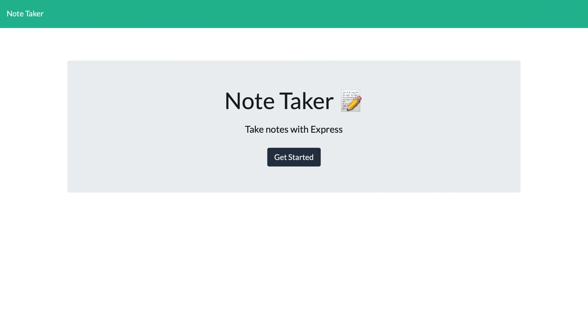

  <header align="center"> 
  <h1> 👓 Note Taker 👓 </h1> 
  </header>

  
    

  # User-Story
    I would like to be able to take notes using a web browser application. I want to be able to store notes in local storage.

  # Table of contents
  * [User-Story](#user-Story)
  * [Description](#Description)
  * [Screenshots](#Screenshots)
  * [Installations](#installations)
  * [Usage](#usage)
  * [License](#license)
  * [Contributing](#Contributing)
  * [Testing-Procedure](#Testing-Procedure)
  * [Contact](#contact)
    

  # Description
    Writting the backend code for a note taking app. This is my first glance at back end coding.

  # Screenshots
  

  # Installations
    express

  # Usage
    Give note a title and content then hit the save button. Then click to sort through notes.

  # Contributing
    Feel free to create pull requests and/or email me with any quieries

  # Testing-Procedure
    Run the code and check for bugs.

  # Contact
  If you would like to reach me in regards to either questions or comments, I am more than 
  happy to respond via github [Hayden-code](https://github.com/Hayden-code) or email [haychjones@gmail.com](haychjones@gmail.com).
    
